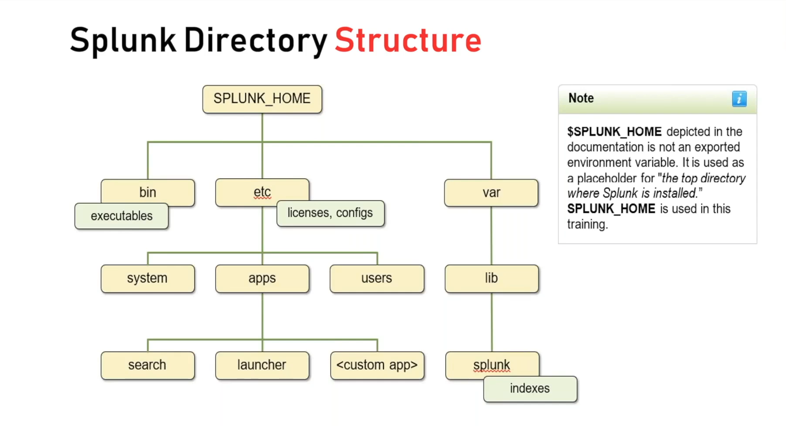
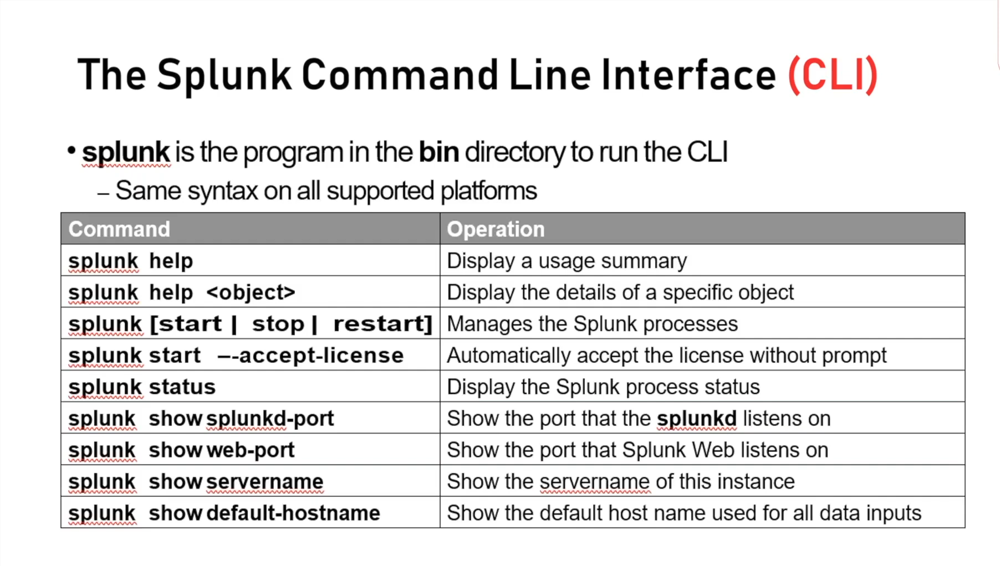

## Splunk Overview

- Splunk can be deploy in a variety of configurations
- Scales from a single server to a distributed infrastructure
  - Accepts any text data as input
  - Parses the inputs into events
  - Stores events in indexes
  - Searches and reports
  - Authentications users

- _Any text Data_
  - DB Servers, Custom Apps, Networking, Security, Servers, Mobile Devices, Web Services

- Input -> Parsing() -> Indexing -> Searching

## Splunk Deployment - Standalone

- _Single Server_
  - All Functions in a single instance of splunk
  - For testing, proof of concept, personal use, and learning
  - This is what you get when you download Splunk and install with default settings
- _Recommendation_
  - Have at least one two/development setup at your site

## What Software Do you Install

- Included in the Splunk Enterprise Software package
  - _Splunk Enterprise_
- Included in the Universal Forwarder software package
  - _Universal Forwarder_

## Splunk Directory Structure

-> Note : **$SPLUNK_HOME** depicted in the documentation is not an exported environment variable. It is used as a placeholder for "The top directory where Splunk is installed".**SPLUNK_HOME** is used in this training.

## The Splunk Command Line Interface (CLI)

---

## Splunk APP

- An app is an independent collection of Configuration Files:
  - Defining inputs, indexes source types, field extractions, transformation
- Most apps are focused on:
  - A specific type of data from a vendor, operating system, or industry
- Apps may be installed on any splunk instance
- Splunk includes a number default apps
