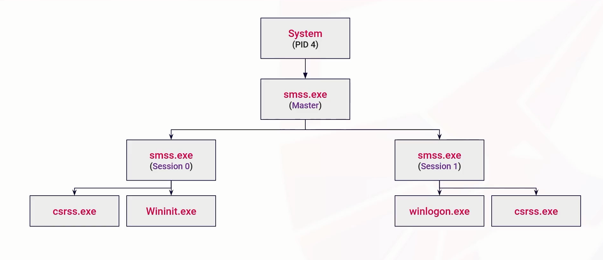

## Processes

- _Running instances of programs and applications_
  - Partitioned set of system resources (CPU, memory, I/O)
- _System (Windows) Processes_
  - OS core functions
  - System, smss.exe, csrss.exe
- _User (Application) Processes_
  - Initiated by users
  - chrome.exe, notepad.exe, minesweeper.exe
- _Service (Background) Processes_
  - Background Functions
  - Windows Update, Print Spooler, Lsass,exe

- _In The Windows CMD_

```bash
$ tasklist
$ tasklist /V
$ tasklist /M
$ tasklist /M /FI
$ tasklist /M /FI "PID eq 2088" /M
$ netstat -anob
$ tasklist /FI "IMAGENAME eq notmalware.exe"
# DLL = Dynamic Link Library
$ wmic
# wmic = Windows Management Instrumentation Command Line
$ wmic process where processid=id get name, parentprocessid, processid
```

- In the Linux

```bash
$ nc -lnvp 3333

```

---

## Windows Core Processes 1

- Task manager

- Process Monitoring and Analysis
  - Process monitoring
  - Process Explorer

---

## smss.exe (Session Manager Subsystem)

- Windows Session manager
- Initiating and managing user sessions
- Launches child processes - wininit.exe, csrss.exe
  

<!-- |--|--| -->

| Variable Index      | Variable Desc                                                    |
| ------------------- | ---------------------------------------------------------------- |
| Image Path          | %SystemRoot%\System32\smss.exe                                   |
| Parent Process      | System (4)                                                       |
| Number of Instances | 1 master, 1 Child instance per session (Children self-terminate) |
| User Account        | Local System                                                     |
| Start Time          | Within seconds of boot                                           |

---

## csrss.exe (Client/Server Runtime Subsystem)

- Managing console Windows
- Importing DLLs for the windows API
- GUI tasks around shutdown

| Variable Name       | Variable Desc                                |
| ------------------- | -------------------------------------------- |
| Image Path          | %SystemRoot%\System32\csrss.exe              |
| Number of Instances | Two or more                                  |
| User Account        | Local System                                 |
| Start Time          | Within seconds of boot (First two instances) |

---

## wininit.exe (Windows Initialization)

- Initialize all he things
- Session 0
- Spawns child processes (services.exe, lsass.exe)

| Variable Name       | Variable Desc                     |
| ------------------- | --------------------------------- |
| Image Path          | %SystemRoot%\System32\wininit.exe |
| Parent Process      | smss.exe (orphan process)         |
| Number of Instances | 1                                 |
| User Account        | Local System                      |
| Start Time          | Within seconds of boot            |

---

## services.exe (Service Control Manager)

 