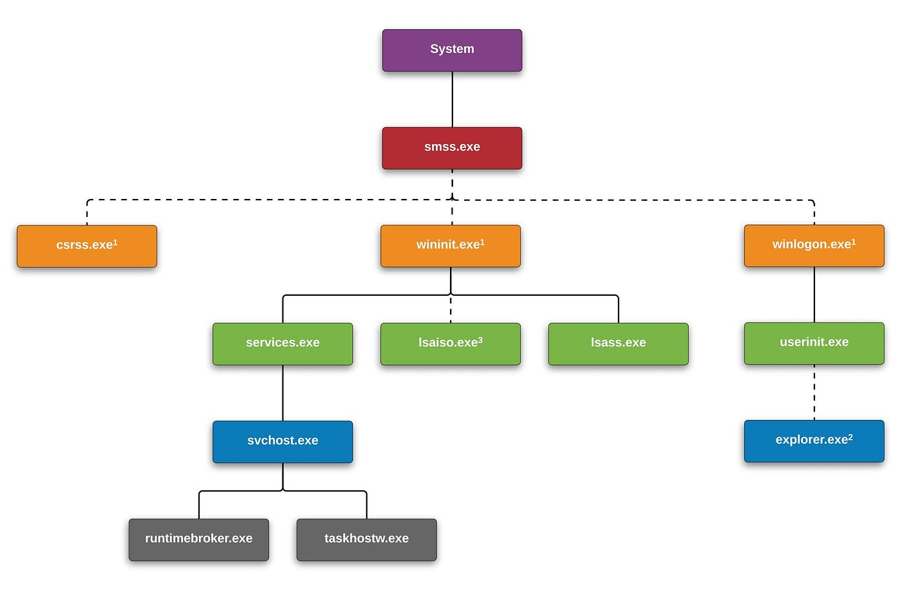

# Windows Process Genealogy



- **What is a Windows Process?**
  Typically an executable program [.exe].Can include other exploitable extensions. Processes start as soon as the machine is booted and for other functions. They help with the GUI interface loading drivers, and controlling DLLs.
- **What is Instance**
  An instance in a Windows process is a single, active running copy of an application or system program loaded into your computer's memory

- System, smss.exe, wininit.exe, RuntimeBroken.exe, Taskhostw.exe, winlogon.exe, csrss.exe, services.exe, svchost.exe, lsaiso.exe, lsass.exe, explorer.exe

```
System
└── smss.exe
    ├── csrss.exe
    ├── wininit.exe
    │   ├── services.exe
    │   │   └── svchost.exe
    │   │       ├── RuntimeBroken.exe
    │   │       └── Taskhostw.exe
    │   ├── lsaiso.exe
    │   └── lsass.exe
    └── winlogon.exe
        ├── userinit.exe
        └── explorer.exe
```

1. **System**
   Responsible for most kernel mode threads. Modules that run under this are primary drivers, .sys files, DLLs and ntoskrl.exe
   _Image Path_ : N/A for system.exe
   Not generated from an executable image
   _Parent Process_ : None
   _Number of Instances_ : One
   _User Account_ : Local System
   _Start Time_: At boot time

2. **smss.exe**
   Session manager process and is responsible for creating new sessions.
   _Image Path_ : %SystemRoot%\System32\smss.exe
   _Parent Process_ : System
   _Number of Instances_ : One master instance and another child per session
   _User Account_ : Local System
   _Start Time_ : Within seconds of boot time for the master instance

3. **wininit.exe**
   Manages drivers and services, along with being a key background process
   _Image Path_ : %SystemRoot%\System32\wininit.exe
   _Parent Process_ : Created by an instance of smss.exe that exits
   _Number of Instances_ : One
   _User Account_ : Local System
   _Start Time_ : Within seconds of boot time

4. **services.exe**
   Hosts non-boot drivers and background services, along with implementing the service control manager [SCM].
   _Image Path_ : %SystemRoot%\System32\services.exe
   _Parent Process_ : wininit.exe
   _Number of Instances_ : One
   _User Account_ : Local System
   _Start Time_ : Within seconds of boot time

5. **svchost.exe**
   A generic process for Windows services and is used for running DDLs. You'll often see many instances of svchost.
   _Image Path_ : %SystemRoot%\System32\svchost.exe
   _Parent Process_ : service.exe
   _Number of Instances_ : Many [more than 100]
   _User Account_ : Varies depending on the instance. Local System, Network Service, or local service accounts
   _Start Time_ : Within seconds of boot time or after boot

6. **RuntimeBroker.exe**
   Acts as a proxy between the UWP and provides the necessary level of access.
   _Image Path_ : %SystemRoot%\System32\RuntimeBroker.exe
   _Parent Process_ : svchost.exe
   _Number of Instances_ : One or more
   _User Account_ : Usually the logged on user
   _Start Time_ : Start time vary

7. **taskhostw.exe**
   The generic host process for windows Tasks that listens for trigger events, such as a user logon, system startup idle CPU time, or a lock/unlock of a workstation.
   _Image Path_ : %SystemRoot%\System32\taskhostw.exe
   _Parent Process_ : svchost.exe
   _Number of Instances_ : One or More
   _User Account_ : Local service accounts and logged on users
   _Start Time_ : Start times vary greatly

8. **lsaiso.exe**
   Windows Credential Guard where the Functionality of lsass.exe will be split into two processes, one of those being lsaiso.exe
   _Image Path_ : %SystemRoot%\System32\Lsaiso.exe
   _Parent Process_ : wininit.exe
   _Number of Instances_ : Zero or One
   _User Account_ : Local System
   _Start Time_ : Within seconds of boot time

9. **lsass.exe**
   Handles the authentication nd authorization services for the system by authentication users and calling an appropriate authentication package found in the registry.
   _Image Path_ : %SystemRoot%\System32\Lsass.exe
   _Parent Process_ : wininit.exe
   _Number of Instances_ : One
   _User Account_ : Local System
   _Start Time_ : Within seconds of boot time

10. **winlogon.exe**
    Manages access to the user desktop and handles interacive logons and loggofs.
    _Image Path_ : %SystemRoot%\System32\winlogon.exe
    _Parent Process_ : Created by an instance of smss.exe that exits, so analysis tools usually don't provide the parent process name
    _Number of Instances_ : One or More
    _User Account_ : Local System
    _Start Time_ : Within seconds of boot time

11. **explorer.exe**
    Provides users access to files. It's both a file browser with Windows Explorer and a user the interface that provides features, including the user's desktop, start menu, taskbar, control panel, and the file extension associations
    _Image Path_ : %SystemRoot%\explorer.exe
    _Parent Process_ : Created by an instance of userinit.exe that exits, so analysis tools usually don't provide the parent process name
    _Number of Instances_ : One or more logged-on users
    _User Account_ : Logged-on users
    _Start Time_ : When the interactive user's logon begins
