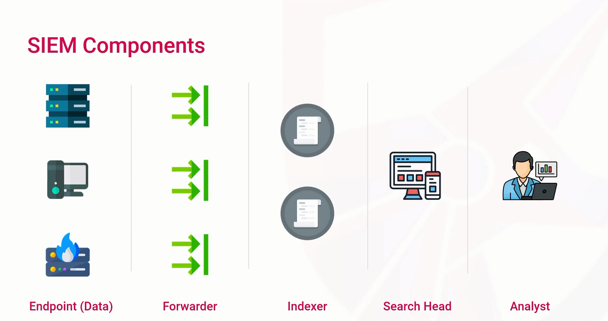
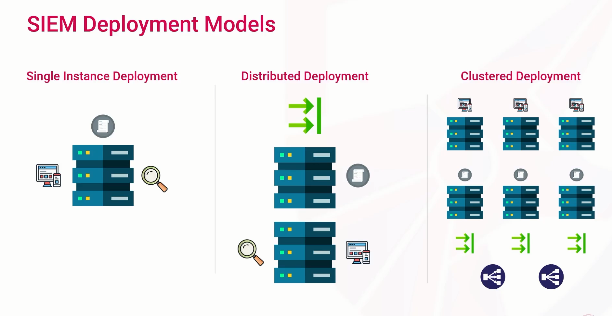
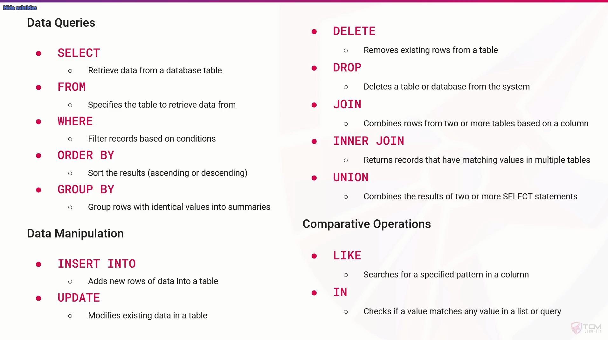

## Domain Objectives

- Understand log management and SIEM deployment architecture
- Identify common attack signatures and patterns within log events
- Learn to manual parse, extract and analyze logs from various sources
- Deploy, configure, and operate an enterprise-grade SIEM solution
- Install a log collection agent and work with real-time events
- Perform incident invertigation and correlation activities using a siem

---

## Security Information and Event Management (SIEM)

- Log Management
- Real-Time Monitoring
- Alerting and Notification
- Incident Response
- Dashboards, Reports, and visualization

---

## SIEM Log Management.

-> Collection, Aggregation, Parsing and Normalization,Retention, Indexing, Correlation and Analysis, Alerting.

- **Collection**
  - Which devices will we collect events from ?
  - Which events do we want to collect ?
  - How long will we retain the logs ?
  - Where will we store the logs ?
  - Methods of Collection ?
    - Agents
    - Agentless

- **Aggregation**
  - Collecting and consolidating events
  - Unify the timeline across the organization
  - Enhancing holistic visibility
  - Allows for correlation and analysis

- **Parsing and Normalization**
  - Ensure consistency across logs
  - Extracting structured information
    - Fields, columns
    - Regular expression, parsing tools, or custom parsers
  - Convert into a common schema
    - Field Mapping
    - Data Transformation
    - Common Event Format (CEF)

- **Retention**
  - Storing log data to ensure analysis availability
    - Incident Response
    - Compliance
  - Log Retention Policies
    - Retention Period
    - Storage Solutions
    - Security Controls
    - Storage Integrity
    - Data Destruction

- **Indexing**
  - Turns raw logs into searchable event data
  - Repository or grouping of events
  - Efficient log retrieval
  - Helps with scaling as log sources grow

- **Correlation and Analysis**
  - Linking related log events together
  - Contextualization
    - Enriching Events with additional metadata
  - Correlation Rules
    - Specify how events should be correlated
  - Correlation Engines
  - Analysis
    - Pattern Recognition
    - Anomaly Detection

- **Alerting**
  - Notify relevant people about security incidents
  - Threshold-Based Alerts
  - Pattern-Based Alerts
  - Anomaly-based Alerts

---

## SIEM Components

## SIEM Deployment Models

---

## Log Types

- **System Logs**
  - Windows Event Logs
  - Sysmon Logs
  - Linux/Unix Syslogs
- **Network Logs**
  - Firewall Logs
  - Proxy Logs
  - DNS Logs
- **Application Logs**
  - Database Logs
  - Web Server / HTTP Logs
  - App Logs
- **Security Logs**
  - Authentication Logs
  - IDS/IPS Logs
  - Endpoint Security Logs
- **Cloud Logs**
  - AWS CloudTrail Logs
  - Azure Activity Logs / Log
  - Analytics
- **Audit Logs**
  - Audit Logs

---

## Log Formats

- **Unstructured Logs**
  - No predefined format or syntax
  - Common Log Format (CLF)
- **Semi-Structured Logs**
  - Some syntax structure
  - Lack adherence to a schema
  - Syslog
  - Windows Event Log (EVT)
- **Structured Logs**
  - Well-defined syntax and formatting
  - Adherence to an agreed upon schema
  - CSV, TSV
  - JavaScript Object Notation (JSON)
  - Extensible Markup Language (XML)

---

## User Behavior Indicators

- **Multiple Failed Login Attempts**
  - Incorrect usernames or passwords
  - Increase in failures from a single user account
  - Increase in failures from multiple user account
- **Login Times**
  - Time of day logons or access requests are taking place
  - Abnormalities from a user's baseline
- **Login/Access Locations**
  - Geographic locations of logons or access requests
  - Unusual countries or regions
  - Impossible travel
- **File Access Patterns**
  - File paths, modifications, or other activity
- **User-Agent Strings**
  - Unusual or associated with known tools

---

## SQL Injection

- Inserting or Injection malicious Sql Statements
- Manipulate expected database queries
  - Retrieve sensitive information
  - Bypass authentication logic

## Data Queries

---

## Cross-Site Scripting

- Executing malicious code by injecting JavaScript
  - Hijack user sessions
  - Steal cookies
  - Deface websites
- Look for <script> tag indicators
- Look for event handlers
  - onload, onclick, onmouseover

---

## Command InJection

- Executing arbitrary OS commands
- Look for special characters that separate commands
  - ;. ||, &&

## Path Traversal / Local File Inclusion

- Accessing files outside of the web root
  - Include or execute unintended files/scripts
- Path Traversal
  - Access files/directories outside of the web root
  - Enumerate the system, read hardcoded credentials
- Local File Inclusion (LFI)
  - Include a local file fro the system
  - Enumerate the system, read hardcoded credentials
  - Execute scripts/ remote code execution
- Look for path traversal sequences
  - URL-encoded characters
- Look for sensitive file paths

---

## Command Line Log Analysis
 